# PHP Dasar

## A. Pengenalan PHP

**PHP** singkatan dari **PHP**: _Hypertext Preprosessor_. PHP
adalah bahasa pemograman yang dikhususkan untuk
membuat website. **PHP** pertama kali dibuat oleh **_Rasmus Lerdorf_** pada tahun _1995_.

## B. Proses Development PHP

Proses Development PHP cukup mudah.

1. Buat file dengan nama bebas, contoh `index.php`
2. File yang sudah di buat nanti hasilnya akan di Load oleh PHP Compiler.
3. Hasil akan tampil sesuai dengan apa yang anda kamu tulis, bisa di terminal atau di web browser.

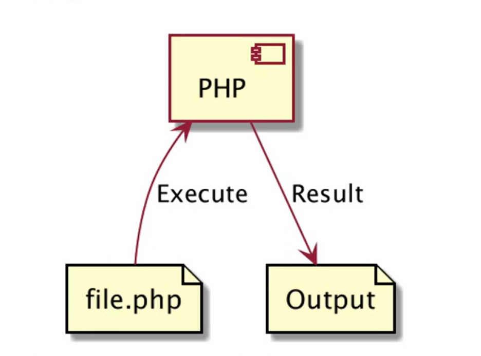

---

### 1. Program "Hello World!" di PHP

- File kode program PHP diakhiri dengan _ekstention_
  `.php`.

- Diawal kode program PHP wajib menambahkan `<?php` dan diakhir kode program juga perlu menambahkan `?>`.

- Dalam penulisan nama file PHP, sangat direkomendasikan tidak menggunakan _spasi_.

- Untuk menampilkan tulisan di PHP, cukup menggunakan perintah `echo`. Dan wajib diakhiri `;` jika tidak kode program akan _error_.

- Kamu bisa melihat hasilnya dengan membuka terminal lalu mengetikkan nama filenya `php namafile.php`.

Contohnya:

```PHP
<?php
echo "Hello World!";

?>
```

---

### 2. Tipe Data Number

Terdapat 2 jenis tipe data di PHP.

- `(int)` Bilangan bulat, punya beberapa basis:

        1. Decimal (base 10),
        2. Hexadecimal (base 16),
        3. Octa (base 8),
        4. Binary (base 2).

- `(float)` Bilangan pecahan.

- Di PHP juga kita bisa menambahkan `_`(garis bawah) untuk mempermudah membahaca angka. namun saat program di eksekusi `_`(garis bawah) tersebut akan di _ignore_ atau dihiraukan. Dan untuk angka negatif bisa menggunakan `-`(tanda minus) didepan angka.

- Kita bisa menggunakan perintah `var_dump` untuk debugging variable.

  1. Tipe data Number:

  ```PHP
  <?php

  echo "Decimal : ";
  var_dump(1234);

  echo "Octal : ";
  var_dump(01234);

  echo "Hexadecimal : ";
  var_dump(0x1A);

  echo "Binary : ";
  var_dump(0b111111);

  echo "Underscore in number : ";
  var_dump(1_241_241_241);
  ```

  Output:

  ```PHP
  Decimal : int(1234)
  Octal : int(01234)
  Hexadecimal : int(26)
  Binary : int(63)
  Underscore in number : int(1241241241)
  ```

  2. Tipe Data Float(Pecahan):

  ```PHP
  echo "Floating Point : ";
  var_dump(1.234);

  echo "Floating Point dengan E notation Plus (1.7 x 1000) : ";
  var_dump(1.2e4);

  echo "Floating Point dengan E notation Minus (1.7 x 0.001) : ";
  var_dump(7e-3);

  echo "Underscore di Floating Point : ";
  var_dump(1_123.123);
  ```

  Output:

  ```PHP
  Floating Point : float(1.234)
  Floating Point dengan E notation Plus : (1.7 x 1000) : float(1700)
  Floating Point dengan E notation Minus : (1.7 x 0.001) : float(0.0017)
  Underscore di Floating Point : float(1123.123)

  ```

  ***

### 3. Integer Overflow

- Secara default, kapasitas integer di PHP ada batasnya, `2147483647` (2 miliyar kurang lebih) untuk sistem operasi _32_ bit,
  dan `9223372036854775807` untuk sistem operasi _64_ bit.

- Jika kita membuat number _integer_ melebihi batas nilai tersebut maka akan secara otomastis tipe numbernya berubah menjadi _floating point_.

  ```PHP
  //sebelum melebihi batas
  echo "Integer Overflow : ";
  var_dump(9223372036854775807);

  //Output:
  Integer Overflow : int(9223372036854775807)


  //setelah melebihi batas
  echo "Integer Overflow : ";
  var_dump(9223372036854775808);

  //Output:
  Integer Overflow : float(9.2233720368547758E+18)
  ```

---

### 4. Tipe Data Boolean

- Tipe data _boolean_ adalah tipe data yang paling sederhana di PHP, tipe data _boolean_ adalah tipe data dengan nilai kebenaran `(benar atau salah)`.

- Nilai benar di presentasikan dengan true (case insensitive)

- Nilai salah di presentasikan dengan false (case insensitive)

- case insensitive artinya bebas cara penulisannya baik `true` huruf kecil semua atau `TRUE` kapital semua.

  ```PHP
  echo "Benar : ";
  var_dump(true);

  echo "Salah : ";
  var_dump(false);
  ```

  Output:

  ```PHP
  Benar : bool(true)
  Salah : bool(false)
  ```

---

### 5. Tipe Data String

- Tipe data _string_ adalah tipe data representasi teks, _string_ bisa kosong atau mengandung banyak karakter.

- Untuk membuat _string_ bisa menggunakan single quote `''` (kutip satu).

- Bisa juga menggunakan double quote `""` (kutip dua), kelebihannya bisa menggunakan _escape sequence_ seperti `\n` untuk "ENTER" dan `\t` untuk TAB, dll.

  ```PHP
  //Single Quote:
  echo 'Nama : ';
  echo 'Gusti Alifiraqsha Akbar';

  //Output:
  Nama : Gusti Alifuraqsha Akbar


  //Double Quote:
  echo "Nama : ";
  echo "Gusti\t Alifiraqsha\t Akbar\n";

  //Output:
  Nama : Gusti    Alifiraqsha     Akbar
  ```

- Ada juga _Multiline String_ bisa digunakan untuk membuat data _string_ lebih dari satu baris. Dan di PHP memiliki fitur bernama _Heredoc_ dan _Nowdoc_

  - _Heredoc_ adalah fitur untuk membuat _string_ panjang tanpa harus "ENTER dan TAB" secara manual.

  1. Heredoc:

  ```PHP
  echo <<<GUSTI
  Lorem ipsum dolor sit amet, consectetur adipiscing elit. Sed do eiusmod tempor incididunt ut labore et dolore magna aliqua. enim ad minim veniam.
  GUSTI;

  //Output:
  Lorem ipsum dolor sit amet, consectetur adipiscing elit. Sed do eiusmod tempor incididunt ut labore et dolore magna aliqua. enim ad minim veniam.
  ```

  2. Nowdoc:

  ```PHP
  echo <<<'GUSTI'
  Lorem ipsum dolor sit amet, consectetur adipiscing elit. Sed do eiusmod tempor incididunt ut labore et dolore magna aliqua. enim ad minim veniam.
  GUSTI;

  //Output:
  Lorem ipsum dolor sit amet, consectetur adipiscing elit. Sed do eiusmod tempor incididunt ut labore et dolore magna aliqua. enim ad minim veniam.
  ```

---

### 6. Variable

- _Variable_ adalaha tempat untuk menyimpan data yang nantinya bisa di gunakan untuk kode program kita.

- Di PHP _variable_ bisa menampung berbagai jenis tipe data dan datanya bisa juga diubah-ubah.

- Cara membuat _variable_ di PHP bisa menggunakan tanda `$` (dolar), lalu nama _variable_ nya perlu di ingat membuat variable tidak boleh menggunakan spasi.

  ```PHP
  $nama = "Gusti";
  $umur = "17";

  echo "Nama :";
  echo $nama;
  echo "\n";

  echo "Umur: ";
  echo $umur;
  echo "\n";

  //Output:
  Nama : Gusti
  Umur : 17
  ```

---

### 7. Contant

- Karena _variable_ di PHP itu 'mutable' yang artinya bisa dirubah. Maka jika ingin membuat _variable_ yang tidak bisa dirubah bisa menggunakan fitur _constant_.

- _Constant_ adalah tempat untuk menyimpan data yang tidak dapat dirubah lagi ketika sudah dideklarasikan.

- Cara membuat _constant_ kita bisa menggunakan perintah `define()`. Lalu disana bisa memasukan 2 parameter, yaitu nama _constant_ nya dan nama _value_ nya.

- Cara terbaik membuat _contant_ adalah menggunakan `UPPER_CASE`.

- Dan ketika ingin mengakases _constant_ nya kita tinggal memanggil nama _contant_ nya.

  ```PHP
  define("AUTHOR", "Gusti Alifiraqsha Akbar");
  define("APP_VERSION", 1.0.0);

  echo "Author : ";
  echo AUTHOR;
  echo "\n";

  echo "App Version : ";
  echo APP_VERSION;
  echo "\n";

  //Output:
  Author : Gusti Alifiraqsha Akbar
  App Version : 1.0.0
  ```

  ***

### 8. Data NULL

- Nilai _NULL_ merepresentasikan _variable_ tanpa nilai, jadi saat ingin mengosongkan nilai _variable_ kita bisa menggunakan _NULL_.

- Kita bisa menggunakan kata kunci _NULL_ untuk membuat data _NULL_ dan sifat nya (case insensitive).

  ```PHP
  $nama = "Gusti";
  $name = null;

  //Output:
  //kosong karena kita mengset nya null.
  ```

- Mengecek apakah data NULL

  - Cara mengetahui sebuah data bernilai _NULL_ atau tidak bisa menggunakan perintah `is_null($variable)`.
  - Hasil dari perintah `is_null` adalah _boolean_.

  ```PHP
    $nama = "Gusti";
    $name = null;

    echo "Apakah nama null? : ";
    var_dump(is_null($nama));

    //Output;
    Apakah nama null? : bool(true)
  ```

- Selain mengubah _NULL_ di PHP kita juga bisa menghapus _variable_, dengan menggunaka perintah `unset($variable)`.

- Namun jika menggunakan perintah `unset` variable yang sudah di hapus tidak akan bisa digunakan lagi.

- Jadi agar lebih aman lebih baik menggunakan perintah `isset($variable)`, ini digunakan untuk mengecek apakah sebuah _variable_ nilainya ada atau _NULL_.

  ```PHP
  $contoh = "Gusti";
  var_dump(isset($contoh));

  //Output:
  bool(true)
  //bernilai 'true' Karena variable contoh ada nilainya, jika tidak ada atau null maka 'false'.
  ```

---

### 9. Tipe Data Array

- _Array_ adalah tipe data yang bisa berisikan banyak data atau kosong, _Array_ di PHP itu dinamis artinya kita bisa memasukan data sebanyak-banyaknya.

- _Array_ di PHP juga bisa berisikan berbagai jenis data baik itu _integer_, _string_ dll.

#### Cara kerja Array

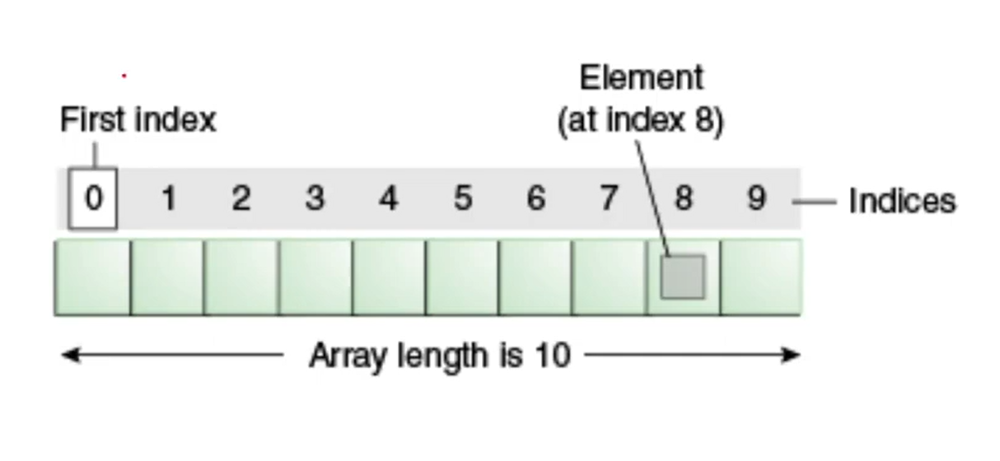

- Jadi _array_ di PHP di mulai dari index 0.

- Contohnya, jika ingin mengambil nilai _array_ yang ke 9 maka kita harus memangil index ke 8. Karena _array_ di PHP dimulai dari 0, atau dikurangi kurangin 1 angka.

- Ada 2 cara pembuatan array:

  ```PHP
  //cara pertama:
  $values = array(1, 2, 3, 4, 7.5);
  var_dump($values);

  //cara kedua:
  $names = ["Elaina", "Kiana", "Asuna"];
  var_dump($names);


  //Output pertama:
  array(5){
    [0]=> int(1)
    [1]=> int(2)
    [2]=> int(3)
    [3]=> int(4)
    [4]=> float(7.5)
  }

  //Output kedua:
  array(3){
    [0]=> string(6) "Elaina"
    [1]=> string(5) "Kiana"
    [2]=> string(5) "Asunaa"
  }
  ```

- Operasi Array
  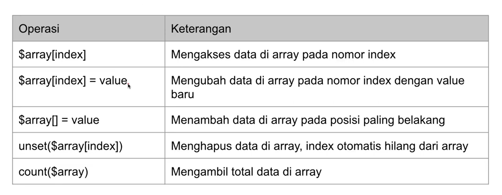

- Array sebagai Map

  - Di PHP kita bisa menggunakan _array_ sebagai map.

  - Secara default _array_ akan menggunakan _index_(number) sebagai _key value_ nya, nah kita bisa bebas memasukan data ke dalam _array_.

  - Dan kita juga bisa mengganti _index_ nya menjadi tipe data lain, _string_ contohnya.

    ```PHP
    $nama = array(
        "id" => 01,
        "nama" => "Kiana Kaslana",
        "umur" => 18
    );
    var_dump(nama);

    //Outputnya:
    array(3){
        ["id"]=> int(01)
        ["nama"]=> string(12)"Kiana Kaslana"
        ["umur"]=>  int(18)
    }
    ```

- Array dalam Array

  ```PHP
  $nama = array(
      "id" => 01,
      "nama" => "Kiana Kaslana",
      "umur" => 18,
      "asal" => array[
          "kota" => "Bogor",
          "Negara" => "Indonesia"
      ]
  );
  var_dump($nama["asal"]["kota"]);

  //Output:
  String(5) "Bogor"
  ```

---

### 10. Operator Aritmatika

- Operasi Aritmatik1 1
  

- Operasi Aritmatika 1
  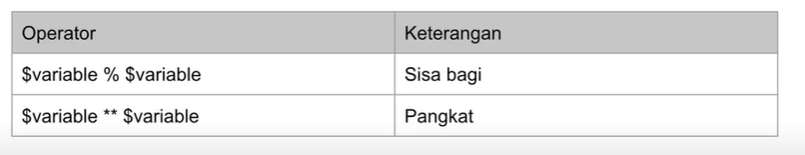

- Kode Operasi Aritmatik

  ```PHP
    $a = 10;
    $b = 10;

    $result = $a + $b;
    var_dump($result);

    //Output:
    int(20)
    //Bisa juga menambahkan "-"(tanda minus), agar hasilnya menjadi negatif.
  ```

---

### 11. Oparator Penugasan

- Operator penugasan di PHP menggunakan `=` (sama dengan).

- Operator penugasan
  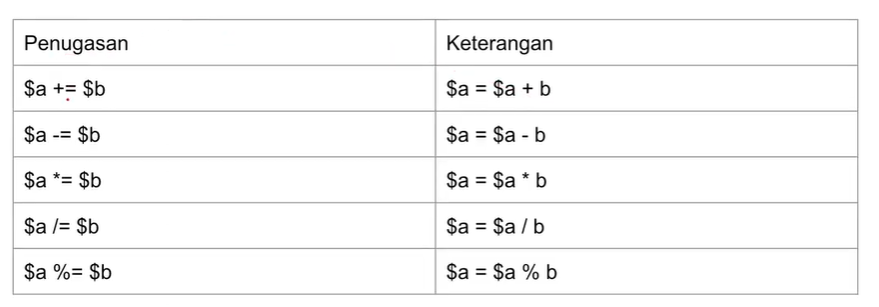

  ```PHP

    $total = 0;

    $fruit = 5000;
    $chicken = 10000;
    $orangeJuice = 5000;


    $total += $fruit;
    $total += $chicken;
    $total += $orangeJuice;

    var_dump($total);

    //Output:
    int(20000)
  ```

---

### 12. Operator Perbandingan

- Sesuai Namanya operator ini digunakan untuk membandingkan 2 buah value.

- Hasil dari operator perbandingan adalah _boolean_, `true` jika benar dan `false` jika perbandingannya salah.

- Operator Perbandingan 1
  

- Operator Perbandingan 2
  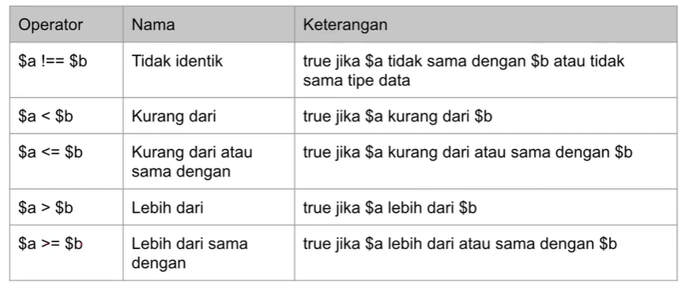

- Kode Operasi

  ```PHP
  var_dump("10" == 10);
  var_dump("10" === 10);

  var_dump(10 < 9);
  var_dump(9 >= 9);

  //Outputnya:
  bool(true)
  bool(false)
  bool(false)
  bool(true)
  ```

---

### 13. Operator Logika

- Operator Logika adalah operator untuk membandingkan nilai _boolean_, dan tidak bisa jika bukan _boolean_.

- Hasil dari operator logika adalah _boolean_ lagi.

  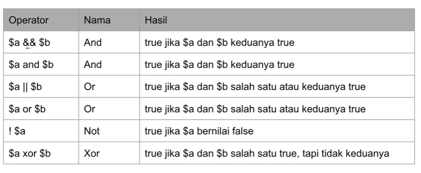

- Kode Program

  ```PHP
  ar_dump(true && true);
  var_dump(true && false);

  var_dump(true || false);
  var_dump(true || true);

  var_dump(true xor false);
  var_dump(true xor true);

  var_dump(!true);
  var_dump(!false);

  //Output:
  bool(true)
  bool(false)

  bool(true)
  bool(true)

  bool(true)
  bool(false)

  bool(false)
  bool(true)
  ```

---

### 14. Increment & Decrement

- PHP juga mendukung gaya bahasa pemograman _**C**_ untuk menaikan data number sejumlah 1 angka.

- Ini berguna mempersingkat ketika ingin menaikan data.

- Operator Increment & Decrement
  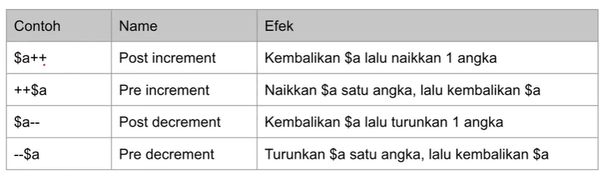

- Kode Operasi

  ```PHP
  $a = 10;
  $b = ++$a;

  var_dump($a);
  var_dump($b);

  //Output:
  int(11)
  int(11)
  ```

---

### 15. Operator Array

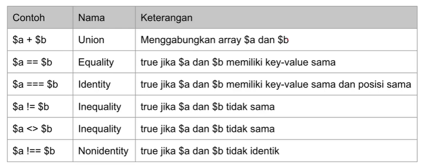

- Kode Operasi Array 1

  ```PHP
  $first = [
  "first_name" => "Gusti"
  ];

  $last = [
      "first_name" => "Gusti",
      "last_name" => "Alifiraqsha"
  ];

  $full = $first + $last;
  var_dump($full);

  //Output:
  array(2) {
  ["first_name"]=>
  string(5) "Gusti"
  ["last_name"]=>
  string(11) "Alifiraqsha"
  }
  ```

- Kode Operasi Array 2

  ```PHP
  $a = [
      "first_name" => "Kiana",
      "last_name" => "Kaslana"
  ];

  $b = [
      "last_name" => "Kaslana",
      "first_name" => ""
  ];

  var_dump($a == $b);
  var_dump($a === $b);

  //Output:
  bool(true)
  bool(false)
  ```

---

### 16. Expression, Statement & Block

- E*xpression* secara sederhana adalah apapun yang memiliki nilai atau value.

- Contohnya

  ```PHP
  $a = 5;
  $b = $a;

  //Contoh Expression yang kompleks
  function getValue()
  {
      return 100;
  }

  value = getValue();
  //function getValue adalah expression karena bernilai 100.
  ```

- _Statement_ bisa dibilang bahasa pelengkap, sebuah _statement_ berisikan execution komplit, bisanya diakhiri dengan `;` titik koma.

  ```PHP
  $nama = "Gusti Alifiraqsha Akbar"

  $date = new DateTime()

  //Semuanya adalah Statement karena merupakan kalimat lengkap.
  ```

- _Blok_ adalah kumpulan _statement_ terdiri dari nol atau banyak _statement_. Blok diakhiri dengan `{}` kurung kurawal.

  ```PHP
  function runApp($name)
  {
      echo "Start Program" . PHP_EQL
      echo "Hello $name" . PHP_EQL
      echo "End Program" . PHP_EQL
  }
  ```

---

### 17. Manupulasi String

Dot Operator

-_Dot_ (titik) adalah operator yang digunakan untuk menambah _string_ dengan data lain/_string._

-Kode Operasi

```PHP
$name = "Gusti Alifiqsha Akbar";

echo "Name : " . $name . PHP_EOL;
echo "Value : " . 100 . PHP_EOL;

//Output:
Name : Gusti Alifiqsha Akbar
Value : 100
```

Konversi ke Number dan Sebaliknya

- Di PHP untuk melakukan konversi bisa menggunakan `()` tanda kurung.

- Kode Operasi

```PHP
$valueString = (string)100;
var_dump($valueString);

$valueInt = (int)"100";
var_dump($valueInt);

$valueFloat = (float)"1.01";
var_dump($valueFloat);

//Output:
string(3) "100"
int(100)
float(1.01)
```

Mengakses Karakter

- _String_ di PHP sama seperti _array_ karakter, dan sama seperti _array_ index pertaman dimulai dari nol.

- Dan jika kita memasukan melebihin index maka akan terjadi _error_.

- Kode Program

```PHP
$name = "Gusti";
echo $name[0] . PHP_EOL;
echo $name[1] . PHP_EOL;
echo $name[2] . PHP_EOL;
echo $name[3] . PHP_EOL;
echo $name[4] . PHP_EOL;

//Output:
  G
  u
  s
  t
  i
```

Variable Parsing

- Khusus _string_ menggunakan _double quote_, kita bisa menggunakan karakter `$` untuk mengakses _variable_.

- Cara penggunaannya dengan cara menggunakan `$` lalu diikuti nama _variable_ nya.

- Kode program

  ```PHP
  echo "Hello " . $name . ", Selamat Belajar PHP" . PHP_EOL;
  echo "Hello $name, Selamat Belajar PHP" . PHP_EOL;

  //Output:
  Hello Gusti, Selamat Belajar PHP
  Hello Gusti, Selamat Belajar PHP
  ```

Curly Brace

- Di PHP kita bisa menggunakan `{}` sebelum menggunakan _variable_ parsing.

- Kode Program

  ```PHP
  $var = "Gusti";
  echo "This is {$var}s" . PHP_EOL;

  //Output:
  This is Gustis
  ```

### 18. If Statement

If Statement

- Hampir disemua bahasa pemogramana menggunakan `if` jika ingin menggunkan percabangan, termasuk di PHP.

- Dengan percabangan kita bisa mengeksekusi kode progaram tertentu ketika suatu kondisi terpenuhi.

- Kode Program

  ```PHP
  $nilai = 80;

  if ($nilai >= 70) {
      echo "Selamat! Anda lulus ujian.";
  }

  //Output:
  Selamat! Anda lulus ujian.
  ```

Else Statement

- `if` akan dieksekusi jika kondisi bernilai _true_.

- Dan kadang kita ingin melakukan eksekusi program tertentu jika kondisi bernilai _false_. Nah itu bisa menggunakan `if else`.

- Kode program

  ```PHP
  $nilai = 10;
  $absen = 90;

  if ($nilai >= 80 && $absen >= 80) {
      echo "Nilai Anda A" . PHP_EOL;
  } else if ($nilai >= 70 && $absen >= 70) {
      echo "Nilai Anda B" . PHP_EOL;
  } else if ($nilai >= 60 && $absen >= 60) {
      echo "Nilai Anda C" . PHP_EOL;
  } else if ($nilai >= 50 && $absen >= 50) {
      echo "Nilai Anda D" . PHP_EOL;
  } else {
      echo "Nilai Anda E" . PHP_EOL;
  }

  //Output:
  Nilai Anda E
  ```

  Syntax Alternatif

- Selain menggunakan `{}`, di PHP juga menyediakan alternatif _syntax_ untuk menggunakan `if` statement, yaitu dengan menggunakan `:`.

- Syarat untuk bisa menggunakan _syntax_ ini, harus menggunakan kata kunci `endif` di akhir statement `if`.

- Kode program

  ```PHP
  if ($nilai >= 80 && $absen >= 80) :
    echo "Nilai Anda A" . PHP_EOL;
  elseif ($nilai >= 70 && $absen >= 70):
      echo "Nilai Anda B" . PHP_EOL;
  elseif ($nilai >= 60 && $absen >= 60):
      echo "Nilai Anda C" . PHP_EOL;
  elseif ($nilai >= 50 && $absen >= 50):
      echo "Nilai Anda D" . PHP_EOL;
  else :
      echo "Nilai Anda E" . PHP_EOL;
  endif;

  //Output:
  Nilai Anda E
  ```

---

### 19. Switch Statemnet

- `Switch` adalah statment percabangan yang sama dengan `if`, dan lebih sederhana cara pembuatannya.

- Kodisi `switch` statement hanya untuk perbandingan `==`, dan menggunakan kata kunci `case`. Dan gunakan kata kunci `break` untuk menghentikan program.

- Alternatif syntanya bisa menggunakan kata kunci `endswitch`.

- kode Program

  ```PHP
  $nilai = "A";

  switch ($nilai){
      case "A":
          echo "Anda lulus dengan sangat baik" . PHP_EOL;
          break;
      case "B":
      case "C":
          echo "Anda lulus" . PHP_EOL;
          break;
      case "D":
          echo "Anda tidak lulus" . PHP_EOL;
          break;
      default:
          echo "Mungkin Anda salah jurusan" . PHP_EOL;
  }

  //output:
  Anda lulus dengan sangat baik
  ```

---

### 20. Ternary operator

- Kita bisa menggunakan _ternary operator_ untuk melakukan pengecekan menggunakan `if` statement.

- _ternary operator_ bisa menggunakan kata kunci `?` dan `:`.

- kode program

  ```PHP
  $gender = "PRIA";
  $hi = $gender == "PRIA" ? "Hi bro!" : "Hi nona!";

  echo $hi . PHP_EOL;

  //Output:
  Hi bro!
  ```

---

### 21. Null Coalescing Operator

- Kita bisa mengecek apakah data _NULL_ atau tidak, selain menggunakan `isset($variable)` kita juga bisa menggunakan _coalescing operator_ menggunakan `??`.

  ```PHP
  $data = [
    "action" => "Create"
  ];
  $action = $data["action"] ?? "Nothing";

  echo $action . PHP_EOL;

  //Output:
  Create
  ```

---

### 22. For Loop

- `For` adalah kata kunci yang bisa kita gunakan untuk melakukan perulangan. Blok kode yang terdapat pada `for` akan terus berulang selama kondisi terpenuhi.

- Kode program

  ```PHP
  for ($counter = 1; $counter <= 10; $counter++) {
    echo "Ini adalah for loop ke-$counter" . PHP_EOL;
  }

  //Output:
  Ini adalah for loop ke-1
  Ini adalah for loop ke-2
  Ini adalah for loop ke-3
  Ini adalah for loop ke-4
  Ini adalah for loop ke-5
  Ini adalah for loop ke-6
  Ini adalah for loop ke-7
  Ini adalah for loop ke-8
  Ini adalah for loop ke-9
  Ini adalah for loop ke-10
  ```

---

### 23. While Loop

- `While loop` adalah versi perulangan sederhana dibandingkan `for loop`, tanpa adanya _init statement_ dan _post statement_.

- `While loop` juga memiliki syntax alternatif nya dengan kata kunci `endwhile`.

- Kode program

  ```PHP
  while ($counter <= 10) {
  echo "Ini adalah for while ke-$counter" . PHP_EOL;
  $counter++;
  }

  //Output
  Ini adalah for while ke-1
  Ini adalah for while ke-2
  Ini adalah for while ke-3
  Ini adalah for while ke-4
  Ini adalah for while ke-5
  Ini adalah for while ke-6
  Ini adalah for while ke-7
  Ini adalah for while ke-8
  Ini adalah for while ke-9
  Ini adalah for while ke-10
  ```

---

### 24. Do While Loop

- `Do While Loop` adalah perulangan yang mirip dengan `while loop`, yang berbeda adalah pengecekan kondisinya.

- Jika `while loop` pengecekan kondisinya dilakukan diawal sebelum perulangan dilakukan, maka `do while loop` dilakukan setelah perulangan.

- Kode program

  ```PHP
  $counter = 100;
  do {
      echo "Ini adalah do while ke-$counter" . PHP_EOL;
      $counter++;
  } while ($counter <= 10);

  //Output:
  Ini adalah do while ke-100
  ```

---

### 25. Break & Continue

- Pada `switch` statement `break` digunakan untuk menghentikan `case` dalam `switch`.

- Namun berbeda dengan `continue`, `continue` digunakan untuk menghentikan perulangan saat ini lalu melanjutkan ke perulangan selanjutnya.

- Kode program `break`

  ```PHP
  $counter = 1;

  while (true) {
      echo "Ini adalah for while ke-$counter" . PHP_EOL;
      $counter++;

      if ($counter > 10) {
          break;
      }
  }

  //Output:
  Ini adalah for while ke-1
  Ini adalah for while ke-2
  Ini adalah for while ke-3
  Ini adalah for while ke-4
  Ini adalah for while ke-5
  Ini adalah for while ke-6
  Ini adalah for while ke-7
  Ini adalah for while ke-8
  Ini adalah for while ke-9
  Ini adalah for while ke-10
  ```

- Kode program `continue`

  ```PHP
  for ($counter = 1; $counter <= 100; $counter++) {
    if($counter % 2 == 0){
        continue;
    }
    echo "Counter : $counter" . PHP_EOL;
  }

  //Output:
  Counter : 1
  Counter : 99
  //sampai 99 karena hanya menampilkan bilangan ganjil
  ```

---

### 26. For Each Loop

- Di PHP terdapat perulangan `for each loop`, yang digunakan untuk mengakses seluruh data `array` secara otomatis.

- Kode program `for each`

  ```PHP
  $names = ["Gusti", "Alifiraqsha", "Akbar"];

  foreach ($names as $name){
    echo "Hello $name" . PHP_EOL;
  }

  //Output:
  Data Gusti
  Data Alifiraqsha
  Data Akbar
  ```

- Kode program dengan `key`

  ```PHP
  $person = [
    "first_name" => "Gusti",
    "middle_name" => "Alifiraqsha",
    "last_name" => "Akbar"
  ];

  foreach ($person as $key => $value) {
      echo "$key : $value" . PHP_EOL;
  }

  //Output:
  first_name : Gusti
  middle_name : Alifiraqsha
  last_name : Akbar
  ```

---

### 27. GoTo Operator

- `Goto` program di PHP digunakan untuk loncat kode program sesuai dengan keinginan kita. Namun fitur ini sangat jarang digunakan karena dapat membingungkan yang membaca kodenya.

- Agar `goto` bisa loncat ke program bisa menggunakan nama label lalu diakhiri `:`.

- Kode program

  ```PHP
  echo "Hello World" . PHP_EOL;

  a:
  echo "Hello A " . PHP_EOL;

  //Ouput:
  Hello World
  hello A
  ```

---

### 28. Function

- `Function` adalah block kode program yang akan berjalan ketika di panggil.

- untuk membuat `function` di PHP bisa menggunakan kata kunci `function namafunction()`, dan diakhiri dengan block.

- Kita bisa memanggila `function` dengan cara `nama function` diikuti `()`.

- Di PHP juga tidak ada aturan dalam pembuatan `function`, kita bebas membuat `function` dimanapun.

- Kode program

  ```PHP
      function sayHello()
      {
          echo "Hello Function" . PHP_EOL;
      }


  sayHello();
  sayHello();

  //Output:
  Hello Function
  Hello Function
  ```

---

### 29. Function Argument

- Kita bisa mengirim informasi ke `function` yang ingin dipanggil, dengan menambahkan _argument_ atau _parameter_.

- Jika *argument*nya lebih dari satu bisa dipisah menggunakan `,`(tanda koma).

- kode program

  ```PHP
  function sayHello($name, $lastname);
  {
    echo "Hello $name" . PHP_EOL;
  }

  sayHello("Kiana");
  sayHello("Kaslana");

  //Output:
  Hello Kiana
  Hello Kaslana
  ```

---

### 30. Default Argument Value

- Jika kita memanggil `function` dan tidak memasukan *parameter*nya bisa menentukan data defaultnya.

- kode program

  ```PHP
  function sayHello($name = Anonymous);
  {
    echo "Hello $name" . PHP_EOL;
  }

  sayHello("Kiana");
  sayHello("Kaslana");
  sayHello("");

  //Output:
  Hello Kiana
  Hello Kaslana
  Hello Anonymous
  ```

---

### 31. Type Declaration

- _Type data_ bisa kita tambahkan di _argument_, sehingga PHP akan mengecek ketika kita mengirim _value_ ke `function` tersebut.

- PHP akan secara otomatis mengkonversi dengan _Type juggling_ seperti dari _string_ ke _int_.

- Kode program

  ```PHP
  function sum(int $first, int $last)
  {
      $total = $first + $last;
      echo "Total $first + $last = $total" . PHP_EOL;
  }

  sum(100, 100);
  sum("100", "100");
  sum(true, false);

  //Output:
  Total 100 + 100 = 200
  Total 100 + 100 = 200
  Total 1 + 0 = 1
  ```

---

### 32. Variable-Leght Argument List

- _Variable-Leght Argument List_ merupakan fitur dimana kita bisa membuat sebuah _parameter_ yang menerima banyak _value_.

- Secara otomatis _Variable-Leght Argument List_ akan membuat _argument_ tersebut menjadi _array_ amun yang membedakan adalah cara mengirim datanya.

- Cara membuat _Variable-Leght Argument List_ bisa menggunakan tanda `...` sebanyak tiga kali sebelum membuat _argument_.

- Kode program

  ```PHP
  function sumAll(...$values)
  {
      $total = 0;
      foreach ($values as $value) {
          $total += $value;
      }
      echo "Total " . implode(",", $values) . " = $total" . PHP_EOL;
  }

  $values = [1, 2, 3, 4, 5];

  sumAll(1, 2, 3, 4, 5);
  sumAll(...$values);

  //Output:
  Total 1,2,3,4,5 = 15
  Total 1,2,3,4,5 = 15
  ```

---

### 33. Funtion Return Value

- Didalam block `function` untuk menghasilkan nilai, kita harus menggunakan kata kunci `return` lalu diikuti dengan data yang ingin dihasilkan.

- Perlu diingat kita hanya bisa menghasilkan 1 data di sebuah `function`.

- Kode program

  ```PHP
  function sum(int $first, int $second):
  {
      $total = $first + $second;
      return $total;
  }

  $result = sum(10, 10);
  var_dump($result);

  $result = sum(100, 100);
  var_dump($result);

  //Output:
  int(20)
  int(200)
  ```

---

### 34. Return Type Declaration

- Kita juga bisa mendeklarasikan tipe data nya sama seperti _argument_, hal ini akan memudahkan ketika membaca tipe data kembalial `function`.

- Gunakan `()` lalu setelah itu bisa tambahkan `:` diikuti tipe data kembaliannya.

- Kode program

  ```PHP
  function sum(int $first, int $second): int
  {
      $total = $first + $second;
      return $total;
  }

  $result = sum(10, 10);
  var_dump($result);

  $result = sum(100, 100);
  var_dump($result);
  ```

---

### 35. Variable Function

- _Variable funtion_ adalah fitur untuk memanggil sebuah `function` dari _value_ yang terdapat sebuah _variable_.

- Untuk menggunakannya bisa langsung memanggila `$namaVariable()`, dan jika ingin menambahkan _argument_ tinggal tambahkan `$namaVariable(argument)`.

- Kode program

  ```PHP
  function sayHello(string $name, $filter)
  {
      $finalName = $filter($name);
      echo "Hello $finalName" . PHP_EOL;
  }

  function sampleFunction(string $name): string {
      return "Sample $name";
  }

  sayHello("Gusti", "sampleFunction");
  sayHello("Gusti", "strtoupper");
  sayHello("Gusti", "strtolower");

  //Output:
  Hello sample Gusti
  Hello Gusti
  Hello Gusti
  ```

---

### 36. Anonymous Function

- `Closure` atau `anonymous function` adalah `function` tanpa nama.

- Biasanya digunakan sebagai _argument_ atau _value variable_.

- `Anonymous function` juga bisa mengirim `function` sebagai _argument_ ke `function` lain.

- Kode program

  ```PHP
  $sayHello = function (string $name) {
    echo "Hello $name" . PHP_EOL;
  };

  $sayHello("Elaina");
  $sayHello("Kiana");

  //Output:
  Hello Elaina
  Hello Kiana
  ```

  Anonymous Function sebagai Argument:

  ```PHP
  function sayGoodBye(string $name, $filter)
  {
      $finalName = $filter($name);
      echo "Good bye $finalName" . PHP_EOL;
  }

  sayGoodBye("Elaina", function (string $name): string {
      return strtoupper($name);
  });

  $filterFunction = function (string $name): string {
      return strtoupper($name);
  };
  sayGoodBye("Elaina", $filterFunction);

  //Output:
  Good bye ELAINA
  Good bye ELAINA
  ```

  Mengakses Variable di luar Closure:

  ```PHP
  $firstName = "Gusti";
  $lastName = "Alifiraqsha";

  $sayHelloGusti = function () use ($firstName, $lastName) {
    echo "Hello $firstName $lastName" . PHP_EOL;
  };
  $sayHelloGusti();

  //Output:
  Hello Gusti Alifiraqsha Akbar
  ```

---

### 37. Arrow Function

- _Arrow function_ adalah alternatif dari _anonymous function_ karena lebih sederhana pembuatannya.

- Pembuatan _arrow function_ menggunakan kata kunci `fn`.

- Kode program

  ```PHP
  $firstName = "Gusti";
  $lastName = "Alifiraqsha";

  $anonymousFunction = function () use ($firstName, $lastName) : string {
      return "Hello $firstName $lastName" . PHP_EOL;
  };

  $arrowFunction = fn() => "Hello $firstName $lastName" . PHP_EOL;

  echo $anonymousFunction();
  echo $arrowFunction();

  //Output:
  Hello Gusti Alifiraqsha
  Hello Gusti Alifiraqsha
  ```

---

### 38. Callback Function

- _Callback_ adalah mekanisme `function` memanggil `function` lainnya sesuai dengan _argument_ yang diberikan.

- Cara untuk memanggil _callback function_ bisa menggunakan `function call_user_func(callable, argument)`.

- Kode program

  ```PHP
  unction sayHello(string $name, callable $filter)
  {
      $finalName = call_user_func($filter, $name);
      echo "Hello $finalName" . PHP_EOL;
  }

  sayHello("Gusti", "strtoupper");
  sayHello("Gusti", "strtolower");
  sayHello("Gusti", function (string $name): string {
      return strtoupper($name);
  });
  sayHello("Gusti", fn($name) => strtoupper($name));

  //Output:
  Hello Gusti
  Hello Gusti
  Hello Gusti
  Hello Gusti
  ```

---

### 39. Recusive Function

- Adalah kemampuan `function` memanggil dirinya sendiri.

- Kode program `Factorial function`

  ```PHP
  function factorialLoop(int $value): int
  {
      $total = 1;

      for ($i = 1; $i <= $value; $i++) {
          $total *= $i;
      }

      return $total;
  }

  var_dump(factorialLoop(5));
  var_dump(1 * 2 * 3 * 4 * 5);

  //Output:
  int(120)
  ```

- Kode program `Factorial Recusive`

  ```PHP
  function factorialRecursive(int $value): int
  {
      if ($value == 1) {
          return 1;
      } else {
          return $value * factorialRecursive($value - 1);
      }
  }

  var_dump(factorialRecursive(5));

  //Output:
  int(120)
  ```

- Error Stack Overflow menggunakan `Recusive Function`

  ```PHP
  function loop(int $value)
  {
      if ($value == 0) {
          echo "End loop" . PHP_EOL;
      } else {
          echo "Loop-$value" . PHP_EOL;
          loop($value - 1);
      }
  }

  loop(3000000);

  //Output:
  Akan error pada kedalaman tertentu tergantuk spek device yang dipakai.
  ```

---

### 40. String Function

- Contoh String Function
  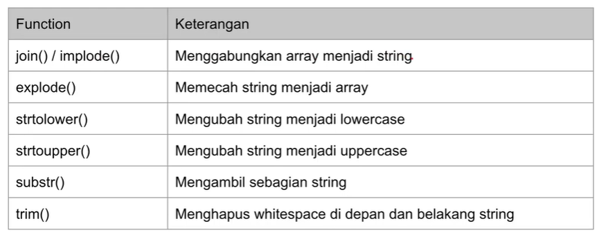

- Kode program

  ```PHP
  var_dump(join(",", [10, 11, 12, 13, 14, 15]));
  var_dump(explode(" ", "Gusti Alifiraqsha Akbar"));
  var_dump(strtolower("GUSTI ALIFIRAQSHA AKBAR"));
  var_dump(strtoupper("gusti alifiraqsha akbar"));
  var_dump(trim("        gusti alifiraqsha       "));
  var_dump(substr("Gusti Alifiraqsha Akbar", 0, 3));

  //Output:
  string(17) "10,11,12,13,14,15"
  array(3) {
    [0]=>
    string(5) "Gusti"
    [1]=>
    string(11) "Alifiraqsha"
    [2]=>
    string(5) "Akbar"
  }
  string(23) "gusti alifiraqsha akbar"
  string(23) "GUSTI ALIFIRAQSHA AKBAR"
  string(17) "gusti alifiraqsha"
  string(3) "Gus"
  ```

---

### 41. Array Function

- Contoh Array Function
  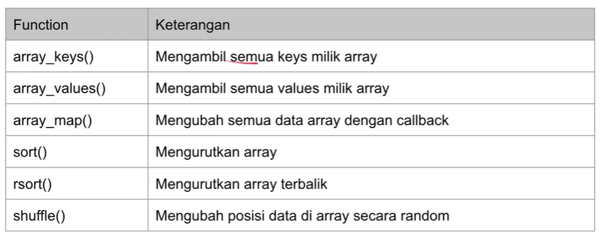

- Kode program

  ```PHP
    $data = [1, 2, 3, 4, 5, 6, 7, 8, 9, 10];

  $dataResult = array_map(fn(int $value) => $value * 10, $data);
  var_dump($dataResult);

  //Output:
  array(10) {
  [0]=>
  int(10)
  [1]=>
  int(20)
  [2]=>
  int(30)
  [3]=>
  int(40)
  [4]=>
  int(50)
  [5]=>
  int(60)
  [6]=>
  int(70)
  [7]=>
  int(80)
  [8]=>
  int(90)
  [9]=>
  int(100)
  }
  ```

---

### 42. Is Function

- Digunakan untuk mengecek tipe data, kebanyakan hasilnya adalah _boolean_, _true_ jika benar dan jika salah _false_.

- Contoh Is Function
  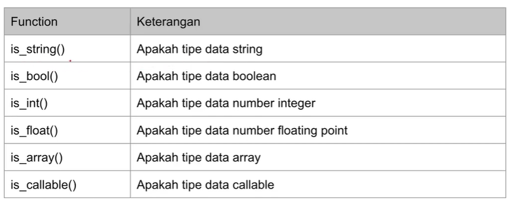

- Kode program

  ```PHP
  $data = "Gusti";

  var_dump(is_string($data));
  var_dump(is_bool($data));
  var_dump(is_int($data));

  //Output:
  bool(true)
  bool(false)
  bool(false)
  ```

---

### 43. Require & Include

- PHP memiliki function `require` & `include` yang bisa digunakan untuk mengambil file php lain, biasanya dari folder yang berbeda.

- Pada `require`, jika file yang diambil tidak ada, maka akan _error_ dan program terhenti.

- Sementara `include`, jika file yang diambil tidak ada, maka hanya memberi peringatan dan program tetap berjalan.

- Nah di PHP ada kata kunci yang memudahkan kita agar tidak terjadi `include` atau `require` berulangkali. Dengaan menggunakan `include_once` atau `require_once`.

- Berguna agar saat mengambil file dari folder yang berbeda tidak terjadi _error_.

- Kode program `include`

  ```PHP
  include "Lib/MyFunction.php";

  echo sayHello("Gusti", "Alifiraqsha");
  ```

- Kode program `require`

  ```PHP
  require "Lib/MyFunction.php";

  echo sayHello("Gusti", "Alifiraqsha");
  ```

---

### 44. Variable Scope

- Di PHP kita bisa membuat _variable_ dimanapun yang kita mau.

- Namun ada istilah _variable scope_ yang artinya di bagian mana saja _variable_ ini bisa diakses.

- PHP memiliki 3 jenis _variable scope_

  1. Global
  2. Static
  3. Local

- Global Scope

  - _variable_ yang dibuat diluar _function_ memiliki _scope global_.

  - Variable di _scope global_ hanya bisa diakses dari luar _function_.

  - Artinya didalam _function_, kita tidak bisa mengakses _global scope_.

- kode program _global scope_

  ```PHP
  $name = "Gusti"; // global scope

  function sayHello()
  {
      echo $name . PHP_EOL;
  }

  sayHello();
  ```

- Local Scope

  - _variable_ yang dibuat didalam _function_ memiliki _local scope_.

  - Variable di _local scope_ hanya bisa diakses dari dalam _function_ itu sendiri.

  - Artinya didalam _function_, kita tidak bisa diakses dari luar _function_ ataupun dari _function lain_.

- Kode program _local scope_

  ```PHP
  function createName()
  {
      $name = "Gusti"; // local scope
  }

  createName();
  echo $name . PHP_EOL;
  ```

- Global Keyword

  - Jika kita ingin mengakses _variable_ diluar _function_ dari dalam _function_, kita bisa menggunakan kata kunci `global`.

  - Dengan menggunakan kata kunci `global` maka hal itu bisa diakses.

- Kode Program `global scope`

  ```PHP
    $name = "Gusti"; // global scope

  function sayHello()
  {
      global $name; // global keyword
      echo $name . PHP_EOL;

      echo $GLOBALS["name"] . PHP_EOL;
  }

  sayHello();

  //Output:
  Gusti
  ```

- Static Scope

  - _Static scope_ memiliki siklus hidup yang berlanjut antara panggilan fungsi.

  - Kode program

  ```PHP
  function increment()
  {
      static $counter = 1; // static scope
      echo "Counter = $counter" . PHP_EOL;
      $counter++;
  }


  increment();
  increment();
  increment();

  //Output:
  Counter = 1
  Counter = 2
  Counter = 3
  ```

---

### 45. Reference

- _Reference_ adalah mengakses _variable_ yang sama dengan nama _variable_ yang berbeda.

- Untuk membuat _reference_ kita bisa menggunakan `&`.

- Kode program

  ```PHP
  $name = "Gusti";

  $otherName = &$name;

  $otherName = "Elaina";

  echo $name . PHP_EOL;

  //Output:
  Elaina
  ```

  ***

## C. Pertanyaan & Catatan Tambahan

- butuh waktu agar saya dapat mengerti semua cara penggunaan kode program di PHP, tapi saya akan terus berusaha yang terbaik agar tidak mengecewakan _**Tim Microvac Bandung**_.

- Saya juga meminta bimbingan dan arahan dari para Tim Microvac Bandung selama saya Magang di Microvac.

---

## D. Kesimpulan

- Dengan adanya bahasa pemograman PHP memberikan kemudahan para developer web untuk membuat website yang dinamis dan bisa bermanfaat bagi banyak orang.

---
